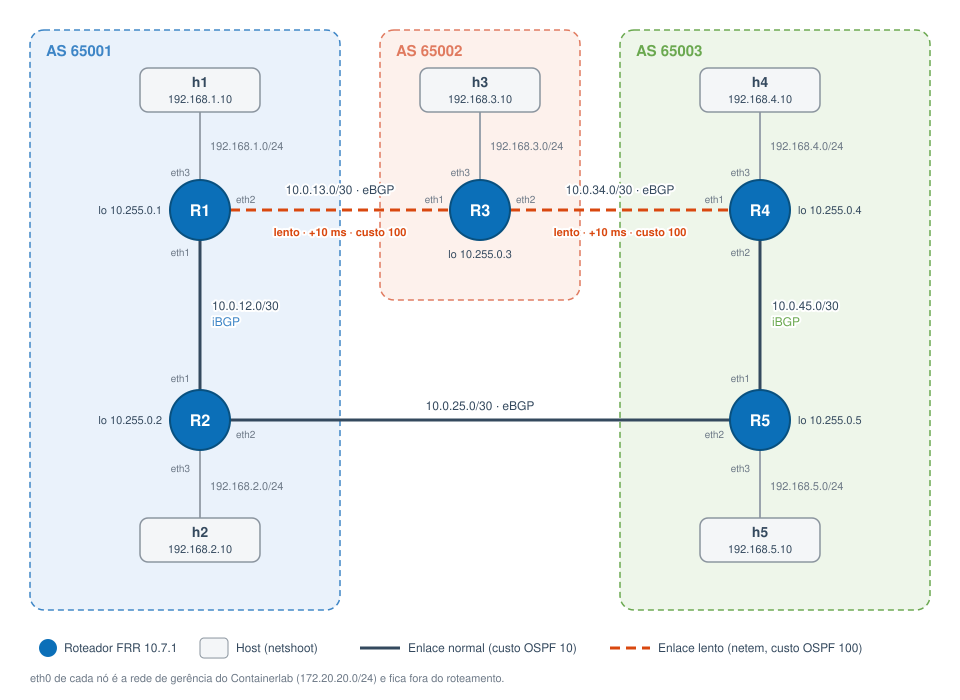

# Comparação de protocolos de roteamento: RIP, OSPF e BGP

Trabalho I de Redes de Computadores (Unisinos, 2026/2). Ambiente experimental com 5 roteadores em 3 Sistemas Autônomos, usado para configurar, observar e comparar RIP, OSPF e BGP sobre a mesma topologia.

## Plataforma

| Componente | Uso |
|---|---|
| **FRRouting 10.7.1** | Plataforma de roteamento (fork ativo do Quagga). Roda `ripd`, `ospfd` e `bgpd`. |
| **Containerlab** | Sobe a topologia inteira a partir de `topologia.clab.yml` (roteadores, hosts e enlaces ponto a ponto). |
| **Docker** | Cada roteador e cada host é um container. |
| **netshoot** | Imagem dos hosts e das ferramentas de medição (tcpdump, tc, ping, fping, traceroute). |

Por que containers funcionam como roteadores: cada container tem o próprio *network namespace* do kernel Linux, ou seja, interfaces, tabela de rotas, ARP e iptables isolados. É virtualização em nível de sistema operacional: os roteadores compartilham o kernel, mas a pilha de rede de cada um é independente.

## Topologia



Fonte editável do diagrama: [`docs/topologia.drawio`](docs/topologia.drawio) (abre no [diagrams.net](https://app.diagrams.net)).

Anel de 5 roteadores: sempre existem dois caminhos entre quaisquer dois pontos. Os enlaces R1-R3 e R3-R4 simulam enlaces de longa distância (atraso de 10 ms por sentido em cada ponta via `tc netem`, custo OSPF 100 contra 10 nos demais).

| Enlace | Rede | Tipo no BGP |
|---|---|---|
| R1 eth1 <-> R2 eth1 | 10.0.12.0/30 | iBGP (AS 65001) |
| R1 eth2 <-> R3 eth1 | 10.0.13.0/30 | eBGP 65001-65002 (lento) |
| R3 eth2 <-> R4 eth1 | 10.0.34.0/30 | eBGP 65002-65003 (lento) |
| R4 eth2 <-> R5 eth1 | 10.0.45.0/30 | iBGP (AS 65003) |
| R2 eth2 <-> R5 eth2 | 10.0.25.0/30 | eBGP 65001-65003 |

Cada roteador Rn tem loopback `10.255.0.n/32` e rede de acesso `192.168.n.0/24` na `eth3`, com o host hn em `192.168.n.10`. A `eth0` é a rede de gerência do Containerlab e fica fora do roteamento.

### Por que cada protocolo escolhe um caminho diferente de h1 até h4

| Protocolo | Critério | Caminho escolhido |
|---|---|---|
| RIP | Menor número de saltos | R1 > R3 > R4 (2 saltos, mas passa pelos enlaces lentos) |
| OSPF | Menor custo acumulado | R1 > R2 > R5 > R4 (custo 30 contra 200) |
| BGP | Menor AS_PATH | R1 > R2 > R5 > R4 (AS_PATH `65003` contra `65002 65003`) |

## Cenários

O enunciado pede que os protocolos **não** rodem simultaneamente. Por isso existem três cenários independentes sobre a mesma topologia física, e em cada um só um daemon de roteamento fica ativo (`configs/<proto>/daemons`):

- **RIP (v2)** e **OSPF (área 0, enlaces ponto a ponto)**: tratam a rede como um único domínio de roteamento interno. As redes de acesso e loopbacks são interfaces passivas.
- **BGP**: usa os 3 AS. eBGP entre AS diferentes e iBGP com `next-hop-self` dentro do mesmo AS. Como os pares iBGP estão diretamente conectados, não é preciso IGP, então o BGP roda sozinho.

Os timers estão declarados explicitamente com os valores padrão, para ficar claro o que está sendo comparado:

| Protocolo | Timers |
|---|---|
| RIP | update 30 s, timeout 180 s, garbage 120 s |
| OSPF | hello 10 s, dead 40 s |
| BGP | keepalive 60 s, hold 180 s (connect retry reduzido para 10 s) |

## Preparação do ambiente

O Containerlab só roda em Linux. Em macOS e Windows o lab roda dentro de um Ubuntu (VM ou WSL2), e os roteadores e hosts continuam sendo containers Docker dentro dele.

| Sistema | Onde o lab roda |
|---|---|
| Linux | Direto no sistema |
| macOS (Intel ou Apple Silicon) | VM Ubuntu no OrbStack |
| Windows 10/11 | Ubuntu no WSL2 |

### Linux (Ubuntu/Debian)

```bash
curl -fsSL https://get.docker.com | sudo sh
bash -c "$(curl -sL https://get.containerlab.dev)"
sudo apt install -y python3-matplotlib

docker pull quay.io/frrouting/frr:10.7.1
docker pull nicolaka/netshoot:latest
```

Em outras distribuições, instale Docker, Containerlab, Python 3 e matplotlib pelo gerenciador de pacotes da distro.

### macOS

1. Instale o [OrbStack](https://orbstack.dev) e crie uma VM Ubuntu:

   ```bash
   brew install orbstack
   open -a OrbStack
   orb create ubuntu:noble redes
   ```

2. Entre na VM com `orb -m redes` e siga os passos de [Linux](#linux-ubuntudebian).
3. A pasta `/Users` do Mac aparece dentro da VM no mesmo caminho, então dá para editar o repositório no Mac e rodar os scripts na VM:

   ```bash
   orb -m redes
   cd /Users/<usuario>/caminho/do/repositorio
   sudo python3 experimento.py rodar todos
   ```

As imagens do FRR e do netshoot têm versão arm64, e o `tc netem` funciona no kernel do OrbStack. Se o Docker Desktop estiver instalado, ele pode continuar no Mac: o lab usa o Docker de dentro da VM.

### Windows

1. No PowerShell como administrador, instale o WSL2 com Ubuntu e reinicie:

   ```powershell
   wsl --install -d Ubuntu-24.04
   ```

2. No Ubuntu, habilite o systemd para o Docker iniciar sozinho:

   ```bash
   printf '[boot]\nsystemd=true\n' | sudo tee /etc/wsl.conf
   ```

   Depois rode `wsl --shutdown` no PowerShell e abra o Ubuntu de novo.
3. Siga os passos de [Linux](#linux-ubuntudebian) dentro do Ubuntu. Use o Docker Engine instalado no WSL, e não a integração do Docker Desktop.
4. Clone o repositório no sistema de arquivos do Linux (`~/`), e não em `/mnt/c`, para evitar problemas de desempenho e permissão.

Sem systemd, inicie o Docker com `sudo service docker start`. Se o kernel do WSL não tiver `netem`, veja [Solução de problemas](#solução-de-problemas).

## Uso

```bash
python3 gerar_configs.py                  # (re)gera configs/ e topologia.clab.yml a partir de topologia.py
sudo python3 experimento.py rodar todos   # roda os 3 cenários em sequência (~20 min)
python3 analisar.py                       # gera resultados/resumo.md, resumo.csv, csv/ e graficos/
```

Também dá para rodar um cenário por vez: `sudo python3 experimento.py rodar ospf`.

### O que o experimento faz em cada cenário

1. Sobe o lab com as configs do protocolo e aplica o atraso nos enlaces lentos.
2. Inicia um `tcpdump` em cada roteador capturando só o tráfego de controle **enviado** (`udp 520`, `proto 89`, `tcp 179`).
3. Mede o tempo até todos os hosts se alcançarem (convergência inicial).
4. Janela de regime de 120 s: tabela de rotas, traceroute h1 > h4, RTT entre pares de hosts, CPU e memória dos roteadores.
5. Teste de falha: ping h1 > h4 a cada 100 ms, e o enlace do caminho ativo que sai de R1 é cortado com `netem loss 100%` nas duas pontas. A interface continua *up*, então cada protocolo precisa detectar a falha pelos próprios timers. Mede o tempo até o ping voltar.
6. Registra tabelas e caminho depois da falha, restaura o enlace e derruba o lab.

### Métricas

| Métrica | Como é obtida |
|---|---|
| Tamanho da tabela de rotas | `show ip route json` (total e aprendidas pelo protocolo) |
| Pacotes de controle | Contagem dos pcaps na janela de regime e durante a falha |
| Taxa de transmissão do protocolo | Bytes dos pcaps / duração da janela (bit/s) |
| Delay | RTT médio do ping entre pares de hosts |
| Convergência inicial | Deploy até todos os hosts se alcançarem |
| Reconvergência | Falha até a primeira resposta do ping h1 > h4 |
| Perda | Pings perdidos durante a falha |
| Recursos | `docker stats` (CPU e memória por roteador) |
| Complexidade de configuração | Linhas essenciais de config do protocolo nos 5 roteadores |

## Estrutura

```
topologia.py          definição única da topologia (roteadores, AS, enlaces, timers)
gerar_configs.py      gera configs/ e topologia.clab.yml
topologia.clab.yml    topologia do Containerlab
configs/rip|ospf|bgp  frr.conf de cada roteador + daemons do cenário
experimento.py        orquestra deploy, medições e teste de falha
analisar.py           calcula métricas, exporta CSVs e gera os gráficos
resultados/           pcaps, JSONs, resumo, CSVs (resultados/csv/) e gráficos de cada cenário
docs/                 topologia, configurações e guia de uso
```

Documentação detalhada:

- [docs/topologia.md](docs/topologia.md): nós, enlaces, endereçamento e caminho escolhido por cada protocolo
- [docs/configuracoes.md](docs/configuracoes.md): configuração do FRR em cada cenário, linha a linha
- [docs/guia.md](docs/guia.md): passo a passo, comandos para explorar a rede e o que é cada arquivo

## Solução de problemas

- **`tc netem` indisponível** (alguns kernels WSL2): o script segue sem atraso nos enlaces lentos e corta enlaces com `iptables DROP`. O OSPF continua escolhendo o caminho pelo custo, mas a diferença de RTT some.
- **Não convergiu**: `docker exec -it clab-redes-r1 vtysh -c "show ip route"` e `docker logs clab-redes-r1`.
- **Lab preso de uma execução anterior**: `sudo python3 experimento.py derrubar`.
