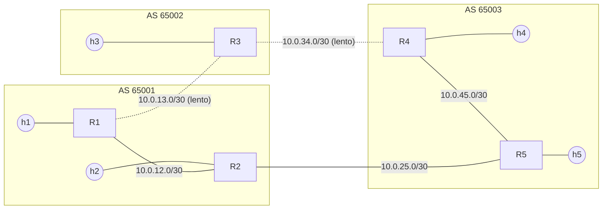

# Topologia

Anel de 5 roteadores FRRouting distribuídos em 3 Sistemas Autônomos, cada um com um host de acesso. Entre quaisquer dois pontos sempre existem dois caminhos, o que permite comparar a escolha de rota e a reconvergência de cada protocolo.

A definição fica em um único lugar, `topologia.py`. O `gerar_configs.py` lê esse arquivo e gera o `topologia.clab.yml` e as configurações dos roteadores.

## Diagrama



```
      AS 65001               AS 65002               AS 65003

        h1                     h3                     h4
         |                      |                      |
        R1 ------ lento ------ R3 ------ lento ------ R4
         |                                             |
        R2 ------------------------------------------ R5
         |                                             |
        h2                                             h5
```

Linhas tracejadas são os enlaces lentos: 10 ms de atraso por sentido em cada ponta via `tc netem`, o que dá cerca de 20 ms a mais de RTT por enlace. No OSPF eles têm custo 100, contra 10 nos demais.

## Nós

| Nó | Tipo | Imagem | AS | Loopback | Rede de acesso (eth3) |
|---|---|---|---|---|---|
| r1 | Roteador | `quay.io/frrouting/frr:10.7.1` | 65001 | 10.255.0.1/32 | 192.168.1.0/24 |
| r2 | Roteador | `quay.io/frrouting/frr:10.7.1` | 65001 | 10.255.0.2/32 | 192.168.2.0/24 |
| r3 | Roteador | `quay.io/frrouting/frr:10.7.1` | 65002 | 10.255.0.3/32 | 192.168.3.0/24 |
| r4 | Roteador | `quay.io/frrouting/frr:10.7.1` | 65003 | 10.255.0.4/32 | 192.168.4.0/24 |
| r5 | Roteador | `quay.io/frrouting/frr:10.7.1` | 65003 | 10.255.0.5/32 | 192.168.5.0/24 |
| h1 a h5 | Host | `nicolaka/netshoot:latest` | - | - | 192.168.n.10, gateway 192.168.n.1 |

Nomes dos containers: `clab-redes-<nó>` (ex.: `clab-redes-r1`, `clab-redes-h4`).

## Enlaces

| Enlace | Rede | Lado A (.1) | Lado B (.2) | Lento | Custo OSPF | Sessão BGP |
|---|---|---|---|---|---|---|
| R1 – R2 | 10.0.12.0/30 | r1 eth1 | r2 eth1 | não | 10 | iBGP (AS 65001) |
| R1 – R3 | 10.0.13.0/30 | r1 eth2 | r3 eth1 | sim | 100 | eBGP 65001–65002 |
| R3 – R4 | 10.0.34.0/30 | r3 eth2 | r4 eth1 | sim | 100 | eBGP 65002–65003 |
| R4 – R5 | 10.0.45.0/30 | r4 eth2 | r5 eth1 | não | 10 | iBGP (AS 65003) |
| R2 – R5 | 10.0.25.0/30 | r2 eth2 | r5 eth2 | não | 10 | eBGP 65001–65003 |

## Interfaces de cada roteador

| Interface | Uso |
|---|---|
| `eth0` | Rede de gerência do Containerlab (172.20.20.0/24). Fica fora do roteamento |
| `eth1`, `eth2` | Enlaces ponto a ponto com os roteadores vizinhos |
| `eth3` | Rede de acesso do host local |
| `lo` | Loopback 10.255.0.n/32, também usada como router-id |

Os hosts usam `eth1` para a rede de acesso, com rotas para `192.168.0.0/16` e `10.0.0.0/8` via o roteador local.

## Caminho escolhido de h1 até h4

A topologia foi montada para que cada protocolo escolha um caminho diferente pelo seu critério:

| Protocolo | Critério | Caminho | RTT medido |
|---|---|---|---|
| RIP | Menor número de saltos | R1 → R3 → R4 (2 saltos, pelos enlaces lentos) | ~47 ms |
| OSPF | Menor custo acumulado | R1 → R2 → R5 → R4 (custo 30 contra 200) | ~0,3 ms |
| BGP | Menor AS_PATH | R1 → R2 → R5 → R4 (AS_PATH `65003` contra `65002 65003`) | ~0,3 ms |

No teste de falha, o enlace cortado é o primeiro do caminho ativo que sai de R1 (R1–R3 no RIP e R1–R2 no OSPF e no BGP), e o tráfego passa para o outro lado do anel.

## Por que containers funcionam como roteadores

Cada container tem o próprio *network namespace* do kernel Linux: interfaces, tabela de rotas, ARP e iptables isolados. Os roteadores compartilham o kernel, mas cada pilha de rede é independente. O Containerlab cria os pares `veth` que ligam as interfaces `ethN` dos containers conforme a lista de `links` do `topologia.clab.yml`.
